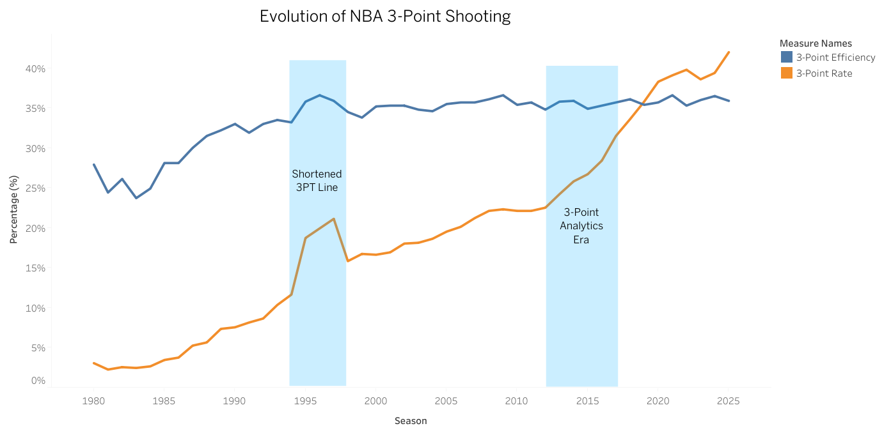
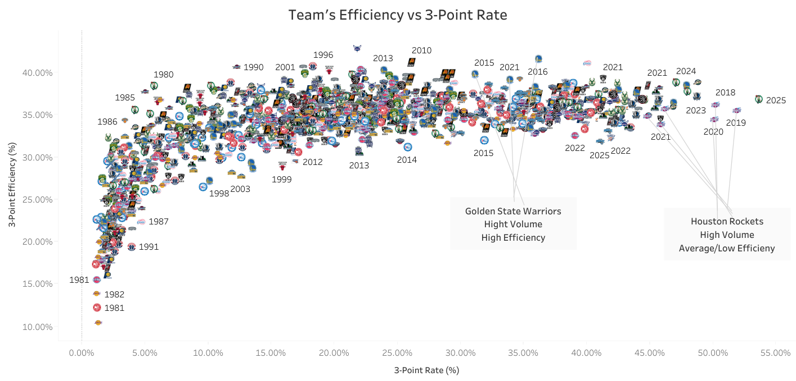
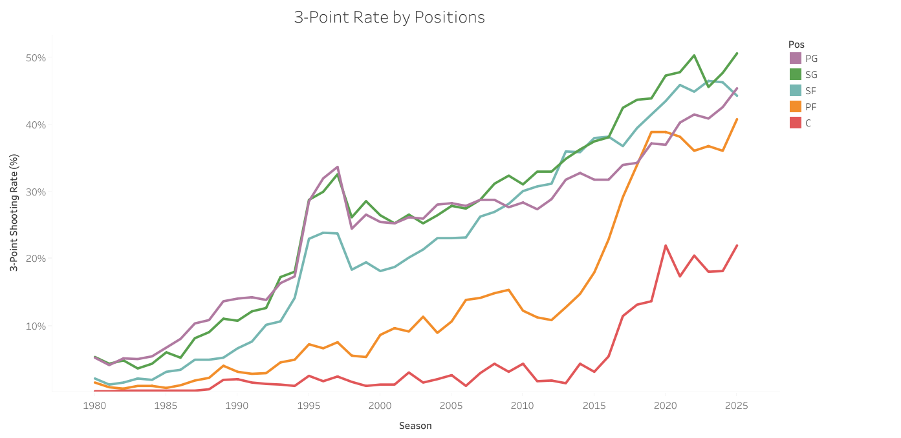

  

  
  

  
# NBA 3-Point Evolution Analysis

This project explores how the use of the three-point shot in the NBA has evolved since its introduction during the season 1979-80. 
Using SQL for analysis and Tableau for visualization, the project examines changes in league strategy, player behavior, and positional roles over time.

## Contents
- [Project Overview](#project-overview)
- [Key Questions](#key-questions)
- [Tools Used](#tools-used)
- [Project Workflow](#project-workflow)
- [Project Reports](#project-reports)
- [Key Insights](#key-insights)
- [Datafolio](#datafolio)
- [Interactive Dashboard](#interactive-dashboard)

## Project Overview

The three-point shot has become one of the most important elements of modern NBA offense. 
This project analyzes historical NBA data to understand how three-point shooting has evolved across teams, players, and positions.

The analysis focuses on identifying key trends in shooting volume, efficiency, and player roles.

## Key Questions

- How has the use of the three-point shot evolved since its introduction in 1979?
- Has three-point efficiency improved as attempts increased?
- How many players attempt high volumes of three-point shots per game?
- How have different player positions adapted to the modern three-point game?

## Tools Used

- **SQL** – Data cleaning and analysis 
- **Tableau** – Data visualization 
- **GitHub** – Project documentation and version control 

## Project Workflow

1. Raw NBA statistics were collected and stored in a database.
2. SQL queries were used to clean and prepare the data. 📄 [View the Data Curation Report](reports/2_Data_Curation.pdf)
3. Exploratory data analysis was performed to identify trends in three-point shooting. 
4. Visualizations were created in Tableau to highlight key insights.
5. Results were compiled into an EDA report. 📄 [View the EDA Report](reports/3_EDA.pdf)
6. Datafolio was created as a project summary. 📄 [View Datafolio](images/Datafolio/three_point_evolution.pdf)
7. Dashboard was created and published in Tableau. 👉 [View on Tableau Public](https://public.tableau.com/views/NBA_3P_Evolution/3PEvolution?:language=en-US&:sid=&:redirect=auth&:display_count=n&:origin=viz_share_link)
8. The final report was compiled with all insights and conclusions. 📄 [View Final Report](reports/4_Final_Report.pdf)

## Project Reports

- 📄 [Project Description & Scope](reports/1_Description_Scope.pdf) 
- 📄 [Data Curation Report](reports/2_Data_Curation.pdf)  
- 📄 [Exploratory Data Analysis (EDA) Report](reports/3_EDA.pdf)
- 📄 [Final Report](reports/4_Final_Report.pdf)

## Key Insights

- The rate of three-point attempts has increased dramatically since the mid-2010s.
  

  
   
  <em>Figure 1: Evolution of three-point attempt rate in the NBA vs Efficiency.</em>
  

- Despite the increase in attempts, league-wide three-point efficiency has remained relatively stable.
  

  
   
  <em>Figure 2: Team Distribution by Efficiency Vs Attempts.</em>
  

- The number of high-volume three-point shooters has grown significantly in recent seasons.
  

  
   
  <em>Figure 3: Count of 3-Point Shooters over Total Players by Season.</em>
  

- Power forwards and centers have increasingly incorporated three-point shooting into their games.
  

  
  
   
  <em>Figures 4-5: Three-point rate evolution by positions and PF/C comparison.</em>
  

## Datafolio

You can view the full datafolio here:  
👉 [Download Datafolio](images/Datafolio/three_point_evolution.pdf)

## Interactive Dashboard

Explore the dashboard here:  
👉 [View on Tableau Public](https://public.tableau.com/views/NBA_3P_Evolution/3PEvolution?:language=en-US&:display_count=n&:showVizHome=no)

### Dashboard Preview

